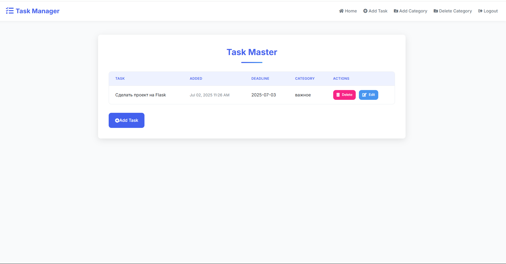

# Task Master - планировщик задач

## Пример интерфейса




## Регистрация пользователей


## Авторизация


**Task Master** - это простое веб-приложение для планирования задач, созданное на Flask с использованием SQLite в качестве базы данных.

## Возможности

- Регистрация пользователей
- Добавление новых задач
- Редактирование существующих задач
- Удаление задач
- Простой и интуитивно понятный интерфейс


## Установка и запуск

1. Клонируйте репозиторий:
```bash
git clone https://github.com/LiptonVova/Task_manager_Flask.git
cd task_manager_flask
```
2. Установите зависимости:
```bash
pip install -r requirements.txt
```

3. Создание репозитория миграции flask-migrate
```bash
flask db init
```

4. Первая миграция базы данных
```bash
flask db migrate 
```

5. Применение изменений базы данных
```bash
flask db upgrade
```

6. Запустите приложение
```bash
flask run
```

7. Откройте в браузере

```
http://localhost:5000
```
## Особенности
- Реализована миграция базы данных через flask_migrate и Alemnic
- Реализована админка через flask_login
- Работа с веб-формами через WTForms
- Реализована связь между таблицами "один ко многим"

## Перспективы
- Реализация тегов 