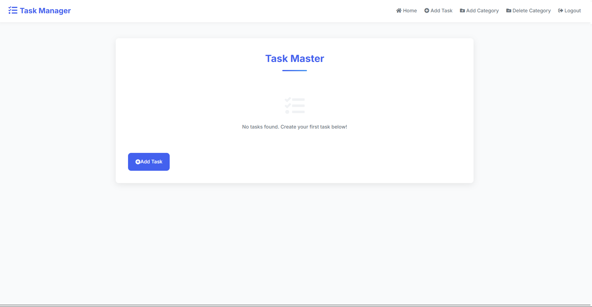

# Task Master - планировщик задач



**Task Master** - это простое веб-приложение для планирования задач, созданное на Flask с использованием SQLite в качестве базы данных.

## Возможности

- Добавление новых задач
- Редактирование существующих задач
- Удаление задач
- Простой и интуитивно понятный интерфейс

## Установка и запуск

1. Клонируйте репозиторий:
```bash
git clone https://github.com/LiptonVova/Task_manager_Flask.git
cd task-master
```
2. Установите зависимости:
```bash
pip install -r requirements.txt
```

3. Запустите приложение
```bash
python app.py
```

4. Откройте в браузере

```
http://localhost:5000
```

## Бета-версия 
Текущая версия приложения является бета-версией проекта. В планах развития:
- Добавление системы регистрации пользователей 
- Категории задач
- Возможность отмечать выполненные задачи
