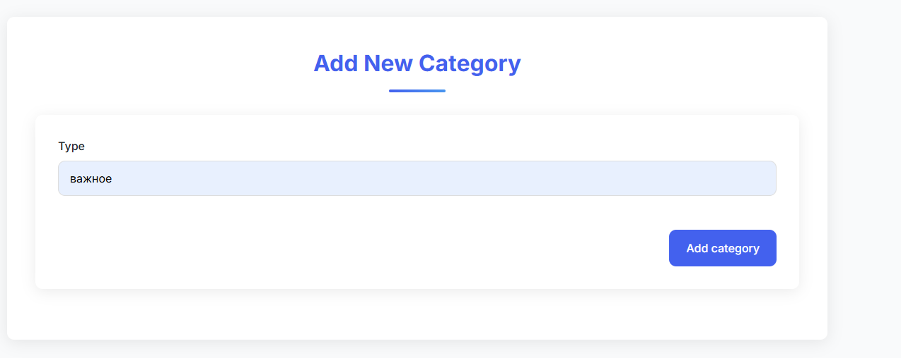
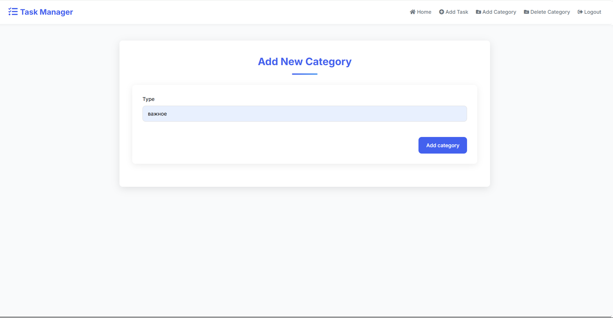

# Task Master - планировщик задач

## Пример интерфейса


## Создание задачи


## Создание категории

## Удаление категории


## Регистрация пользователей


## Авторизация


## **Task Master** - это простое веб-приложение для планирования задач, созданное на Flask с использованием SQLite в качестве базы данных.

## Возможности

- Регистрация пользователей
- Добавление новых задач
- Редактирование существующих задач
- Удаление задач
- Создание категорий 
- Каждой задаче можно присвоить свою категорию
- Возможность удалять категории
- Простой и интуитивно понятный интерфейс


## Установка и запуск

1. Клонируйте репозиторий:
```bash
git clone https://github.com/LiptonVova/Task_manager_Flask.git
cd task_manager_flask
```
2. Установите зависимости:
```bash
pip install -r requirements.txt
```

3. Создание репозитория миграции flask-migrate
```bash
flask db init
```

4. Первая миграция базы данных
```bash
flask db migrate 
```

5. Применение изменений базы данных
```bash
flask db upgrade
```

6. Запустите приложение
```bash
flask run
```

7. Откройте в браузере

```
http://localhost:5000
```

## Для работы через Docker

1. В файле .env изменить BUILD_TYPE в зависимости от ситуации либо на Debug (дебаг режим), либо на Release (стабильная версия)
Процесс дебага через vscode будет описан ниже

2. Создать и запустить контейнер
```bash 
docker compose up --build
```

## Процесс дебага

1. Запустить приложение в Debug режиме через Docker. 

2. Выполнить следующую последовательность действий
```
mkdir .vscode
cd .vscode
touch launch.json
```

3. В launch.json вставить следующий код:
```
{
    "version": "0.2.0",
    "configurations": [
        {
            "name": "Docker Attach Flask",
            "type": "debugpy",
            "request": "attach",
        
            "connect": {
                "host": "localhost",
                "port": 5678
            },

            "pathMappings": [
                {
                    "localRoot": "${workspaceFolder}",
                    "remoteRoot": "/app"
                }
            ],
        },
    ]
}
```

4. Теперь можно удаленно подключиться к приложению через Debug VSCode. Для этого заходим во вкладку "Run and debug". Далее выбираем Docker Attach Flask, запускаем. Дебаг готов: ставим брейкпоинты, построчно запускаем код


## Особенности
- Реализована миграция базы данных через flask_migrate и Alemnic
- Реализована админка через flask_login
- Работа с веб-формами через WTForms
- Реализована связь между таблицами "один ко многим"
- Обернут в Docker
- Структура проекта выполнена в соответствии с современным патерном Flask - Blueprint. 
    * Проект разбит на 3 основных Blueprint, которые отвечает только определенной теме проекта: на home (домашняя страница), 
    main (основная логика приложения: добавление, редактирование, удаление задач и категорий),
    auth (логика регистрации пользователей)

## Перспективы
- Обработка ошибок
- Возможность оставить только выбранную категорию 

## Для проверки, что хранится в базе данных можно использовать следующие команды:

```bash 
sqlite3 app.db
.schema <название базы данных>
.table
.dump
```